# تصنيف لغة الاشارة للحروف العربية


Read this in English language: [English Ver.](README_EN.md)

## جدول المحتويات
- [تصنيف لغة الاشارة للحروف العربية](#تصنيف-لغة-الاشارة-للحروف-العربية)
  - [جدول المحتويات](#جدول-المحتويات)
  - [وصف المشروع](#وصف-المشروع)
  - [وصف مختصر للبيانات](#وصف-مختصر-للبيانات)
  - [كيف يعمل التطبيق ؟](#كيف-يعمل-التطبيق-)
  - [مُخرجات التصنيف من الخوارزمية](#مُخرجات-التصنيف-من-الخوارزمية)
  - [البيانات](#البيانات)
  - [طريقة تقسيم البيانات](#طريقة-تقسيم-البيانات)
  - [تحليل البيانات واستكشافها](#تحليل-البيانات-واستكشافها)
    - [بيانات غير متوازنه](#بيانات-غير-متوازنه)
    - [فحص أبعاد الصورة](#فحص-أبعاد-الصورة)
      - [فحص متعمق للأبعاد الخاصه بالصورة](#فحص-متعمق-للأبعاد-الخاصه-بالصورة)
    - [عرض الصور من كلاس واحد](#عرض-الصور-من-كلاس-واحد)
  - [المعماريات](#المعماريات)
    - [أول نموذج مرجعي (شبكة عصبية ترشيحية)](#أول-نموذج-مرجعي-شبكة-عصبية-ترشيحية)
    - [CNN V2](#cnn-v2)
  - [مقاييس الخطأ](#مقاييس-الخطأ)
    - [مقياس الخطأ للنموذج المرجعي](#مقياس-الخطأ-للنموذج-المرجعي)
    - [الشبكة العصبية الترشيحية النسخة الثانية](#الشبكة-العصبية-الترشيحية-النسخة-الثانية)
  - [مصفوفة الدقة للنموذج المرجعي](#مصفوفة-الدقة-للنموذج-المرجعي)
  - [مقياس إف 1 للنموذج المرجعي](#مقياس-إف-1-للنموذج-المرجعي)
  - [مقياس إف 1 لمعمارية الشبكات العصبية الترشيحية النسخة 2](#مقياس-إف-1-لمعمارية-الشبكات-العصبية-الترشيحية-النسخة-2)
  - [تصنيف على المجموعة الاختبارية](#تصنيف-على-المجموعة-الاختبارية)
    - [النموذج المرجعي](#النموذج-المرجعي)
    - [معمارية الشبكة العصبية الترشيحية النسخة 2](#معمارية-الشبكة-العصبية-الترشيحية-النسخة-2)
  - [رفع المشروع على سحابة الكترونية](#رفع-المشروع-على-سحابة-الكترونية)
    - [طريقة استعماله وتصنيبه](#طريقة-استعماله-وتصنيبه)
  - [المكتبات المستعملة](#المكتبات-المستعملة)
  - [قائمة واحتمالات تطوير المشروع القادمة](#قائمة-واحتمالات-تطوير-المشروع-القادمة)
  - [المشاركة بتطوير المشروع](#المشاركة-بتطوير-المشروع)
  - [التحديثات](#التحديثات)
  - [المراجع والرخص المستخدمة للحقوق](#المراجع-والرخص-المستخدمة-للحقوق)


## وصف المشروع
تصنيف لغة الإشارة للحروف العربية هو مشروع من مشاريع تعلم الآلة. يحاول فيها تصنيف أي من حركات اليد تعبر عن أي حرف هو وما هو معناه لاحقاً سوف يتم تجميع الحروف فيها وإنشاء كلمة (ولكن هذا تحت التجربة) من خلال الفيديو الذي سوف ترسله إلى الخوارزمية هذه. التصنيف سوف يتم عن طريق 32 كلاس مختلف عن الحروف العربية الموجودة في مجموعة البيانات التي نملكها. المشروع قائم الآن على معمارية الشبكات العصبية الترشيحية .


## وصف مختصر للبيانات
هذا المشروع قائم على مجموعة البيانات التي تحصلنا عليها من بحث قائم على هذا
النوع من المشكلة وقائم الباحثون جزاهم الله خيرهم بنشر مجموعة البيانات
هذه للجميع من أجل البحوث الأخرى وغيره...

من أجل رؤية وصف أكثر عن مجموعة البيانات هذه الانتقال إلى القسم:
[البيانات](#Data)

مصدر مجموعة البيانات هذه: [Data Mendely](https://data.mendeley.com/datasets/y7pckrw6z2/1)


## كيف يعمل التطبيق ؟
- تجهيز فيديو من أجل ترجمته وتصنيفه
- اضغط على كلمة browse ثم ابحث عن الفيديو
- من أجل تصنيف حركات اليد وترجمتها التي بالمقطع الضغط على Submit
- الآن تم تصنيف كل حركة يد وما معناها وسوف تظهر بمربع أخضر الكلمة (قيد التطوير)


## مُخرجات التصنيف من الخوارزمية
مُخرجات هذا المشروع سوف تقوم الخوارزمية بإرجاع لك نفس الفيديو الذي قمت
بمعالجته وإرساله ولكن سوف تلاحظ بالأعلى على اليسار سوف تجد كل كلاس
يراه المودل صحيحًا أنها تتناسب مع لغة الإشارة


## البيانات
مجموعة البيانات المستخدمة في المشروع: [صفحة البيانات](https://data.mendeley.com/datasets/y7pckrw6z2/1) جميع الحقوق محفوظة لأصحابها الكرام

- "A new dataset consists of 54,049 images of ArSL alphabets performed by more than 40 people for 32 standard Arabic signs and alphabets. The number of images per class differs from one class to another. Sample image of all Arabic Language Signs is also attached. The CSV file contains the Label of each corresponding Arabic Sign Language Image based on the image file name."

## طريقة تقسيم البيانات
في تقسيم البيانات لمجموعات لقد استخدمت هذه المكتبة [Split folders](https://pypi.org/project/split-folders/).
التقسيمة كانت بالمقاييس الآتية:
- 60% تذهب لمجموعة التدريب
- 20% تذهب لمجموعة التحقق
- 20% تذهب لمجموعة الاختبار

لاحقاً عندما نريد تحميل البيانات ومعالجتها سوف نستخدم `ImageDataGenerator`
من أجل استخدام تقنية "زيادة البيانات" عند تدريب المودل

كلمات مفتاحية: 
- زيادة البيانات = Data augmentation


## تحليل البيانات واستكشافها
### بيانات غير متوازنه
حسناً سوف نقوم الآن بفحص كل ملف يحتوي على الكلاس الخاص به من الصور ونريد
فحص هل التوزيع الخاص بالكلاسات لكل صورة متوازن ؟ أم لا

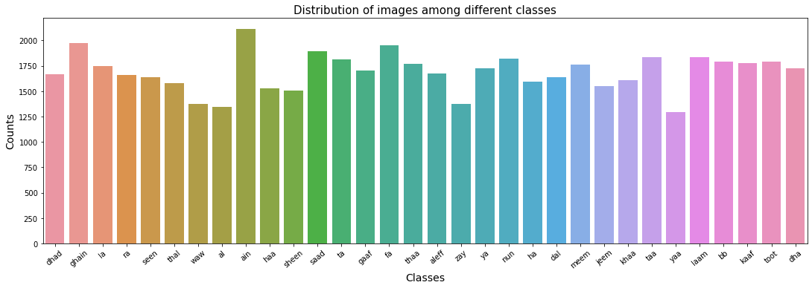

كما نرى من المخطط في الأعلى أنها ليست كلاسات متوازنة وهنالك فروقات قمم وقيعان كثيرة وهذه دلاله على أن هنالك مشكلة تسمى بالبيانات غير المتوازنة،
وعلى سبيل المثال لغة الإشارة الخاصة ب "ال" و "حرف الواو" و "ئ" قليلة جداً بياناتها مقارنة بالباقين. ولذلك سوف نستعمل تقنية "تقليل العينات" بناء على قيمة أصغر كلاس يمتلك صور. وسوف يتم تطبيق ذلك جميع المجموعات التي لدينا من تدريب، تحقق، اختبار.

كلمات مفتاحية:
- تقليل العينات = Undersampling


### فحص أبعاد الصورة
لنبدأ بفحص أبعاد الصور ونرى توزيع الأبعاد لكل صورة من طول وعرض طبعاً إذا وجد ذلك سوف نقوم بوضع رقم محدد من أجل جعل كل الصور بأبعاد واحدة ويمكننا من معالجتها في خطوة معالجة الصور لاحقاً ويتمكن المودل من التدرب عليها، لكن الآن لنرى ما هي الأغلبية إذا وجدت من أبعاد الصور التي تملكها هذه المجموعة من البيانات

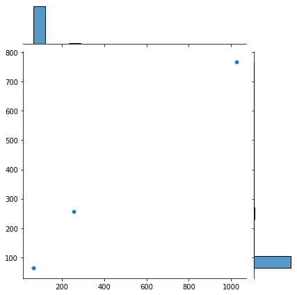

حسناً بعد فحص الصور نرى بكل وضوح أن الأبعاد على مستوى قياسي
من الأبعاد لذلك سوف نختار الرقم الذي يمتلك الأغلبية لاحقاً

لكن دعونا نرى ما هي الأرقام لكي نستطيع الاختيار...

#### فحص متعمق للأبعاد الخاصه بالصورة
الآن لنرى ما هي الأبعاد كأرقام ونرى ما هي الأرقام لكل من الارتفاع والعرض للصور لكي نستطيع لاحقاً في معالجة الصور بالأطوال التي سوف نختارها الآن. نقطة مهمة سوف نستعمل أقل قيمة لكي نجعل باقي الصور بنفس حجمها والسبب لذلك أن خوارزمية التعلم العميق تستطيع استخراج المعلومات منها أفضل من أن نقوم بتوسيع البكسلات للصور الصغيرة وتفقد معلوماتها وأهميتها ولا يستطيع المودل من استخراج أي شيء منها.


**معلومات عن الارتفاع**:
```python
values, counts = np.unique(dim1, return_counts=True)
values, counts

# Outputs: (array([  64,  256, 1024]), array([53401,   638,    10]))
```

**معلومات عن العرض**:
```python
values_2, counts_2 = np.unique(dim2, return_counts=True)
values_2, counts_2

# Outputs: (array([ 64, 256, 768]), array([53401,   638,    10]))
```

نستطيع أن نرى أنه عدد العينات: [53401,   638,    10] وهذا واضح جداً أنه يمكننا اختيار البُعد 64 *64 بكل أريحية والسبب أنه يمتلك أعلى تكدس بمجموع الصور وأيضاً هو أصغر بُعد منهم


### عرض الصور من كلاس واحد
في هذا الجزئية سوف نقوم باستعراض بعض الصور بشكل عشوائي من أحد الكلاسات الموجودة بمجموعة البيانات التي لدينا والهدف لكي نرى ماهي الزوايا, موضع اليد, نوع الصورة هل هي بالالوان ولا ابيض واسود, الاضاءة, هل الصور تالفه, خلفيات الصُور هل هي خاليه من أي شيء, تشويش بالصور مثل وجود ناس بالخلفية.


هذه صورة من حرف العين
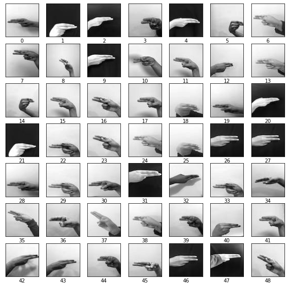

ممتاز!، الآن لقد عرفنا أن الصور تم تحويلها إلى الأبيض والأسود من قبل لذلك قبل تدريب الخوارزمية سوف نقوم بتحويلها إلى صورة تملك الألوان الثلاثة وهي الأحمر، الأخضر، الأزرق. من أجل أن نتمكن من تدريب الخوارزمية عليها.


## المعماريات
### أول نموذج مرجعي (شبكة عصبية ترشيحية)
المعمارية المستخدمة للنموذج المرجعي الأول وطبقاتها هي كالآتي:
| Layer Name | Value |
| ---- | ---- | 
| Conv2D | Filters=64, Kernels=3 |
| MaxPool2D | Default=2 |
| Conv2D | Filters=64, Kernels=3  |
| MaxPool2D | Default=2 |
| Conv2D | Filters=128, Kernels=3 |
| Conv2D | Filters=128, Kernels=3 |
| MaxPool2D | Default=2 |
| GlobalAveragePooling2D | Without passing anything keep defaults |
| Dense | units=32 with softmax |

تقييم الأداء على بيانات الاختبار:
```sh
هامش الخطأ = 25%, الدقة= 94%.
```

----
### CNN V2
معمارية الشبكة العصبية الترشيحية النسخة الثانية وسميت بذلك لأنها خضعت لتقنية تقليل العينات التي طرحناها بالأعلى والمودل السابق لم يخضع لها


| Layer Name | Value |
| ---- | ---- | 
| Conv2D | Filters=64, Kernels=3 |
| MaxPool2D | Default=2 |
| Conv2D | Filters=64, Kernels=3  |
| MaxPool2D | Default=2 |
| Conv2D | Filters=128, Kernels=3 |
| Conv2D | Filters=128, Kernels=3 |
| MaxPool2D | Default=2 |
| GlobalAveragePooling2D | Without passing anything keep defaults |
| Dense | units=32 with softmax |

```sh
هامش الخطأ = 22% والدقة = 96%
```


## مقاييس الخطأ
### مقياس الخطأ للنموذج المرجعي
تستخدم من أجل فهم كيف هو أداء الخوارزمية أثناء التدريب  للنموذج المرجعي

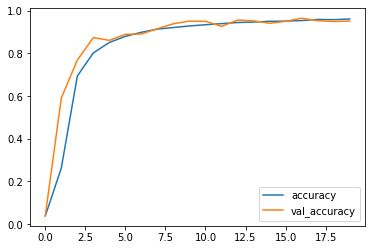

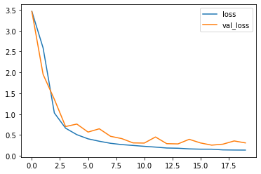

نستطيع أن نرى أن `val_loss` وقعت في مشكلة "فرط التخصيص" ولم تستطع أن تقترب من مستوى جيد لكن في تطوير مستقبلي نحتاج إلى تحسين نتائج المودل عن طريق تطبيق إحدى الطرق من "زيادة البيانات" وبعض التقنيات الأخرى.

كلمات مفتاحية:
- فرط التخصيص = Overfitting

---
### الشبكة العصبية الترشيحية النسخة الثانية
بالنسبة لمعمارية الشبكات العصبية الترشيحية الخط لهامش الخطأ يقترب بشكل أدق قليلاً.

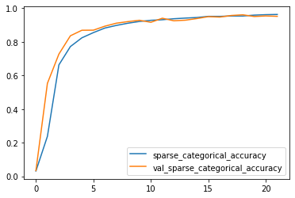

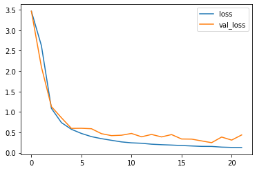

من أجل توضيح الفروقات بين الاثنين نرى في هذه التجربة أن خطوط هوامش الخسارة قريبه من بعضها ولاتملك تموج بشكل كبير خطوطها مع أنها واقعه بمشكلة فرط التخصيص كذلك ولكنها أفضل من أول تجربة ولكن نقول أيضاً إنها تحتاج إلى تحسين بشكل أفضل من هذا من أجل تصنيف لغات الإشارة للحروف العربية من الواقع وتستطيع الخوارزمية من تصنيفها بشكل أدق.


## مصفوفة الدقة للنموذج المرجعي
طريقة جيدة ورائعة لرسم العلاقات بالكلاسات الأصلية والكلاسات التي تم تصنيفها من قبل المودل وهل هي صحيحة أم هنالك تشويش وضعف بقدرة التصنيف لبعض الكلاسات .
النتيجة المثالية لهذه المصفوفة هو خط من أعلى اليسار إلى أسفل اليمين على شكل قُطر.

بقية المربعات من هذا الخط تسمى كالآتي:
- FP (False positives) = تصنيف إيجابي خاطئ
- FN (False negative) = تصنيف سلبي خاطئ

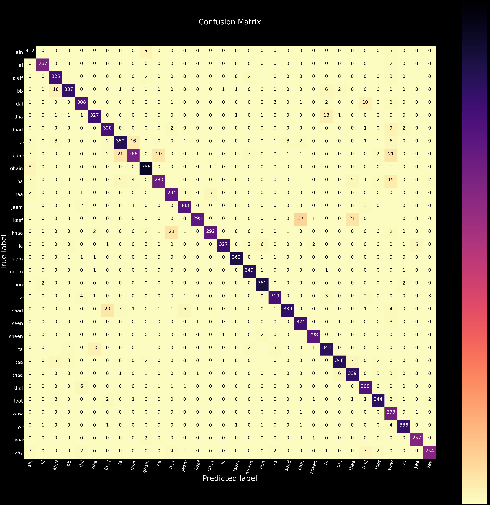

من خلال هذه الرسمة نستطيع استخراج معلومات منها وهي التباسات حصلت للخوارزمية مع الكلاسات(الحروف) وأمثله على هذه الالتباسات مثل:
- التباس بين حرفي "القاف" و "الكاف" وتقاربهم بشكل كبير بالشكل حتى بالنسبة للبشر المبتدئين في لغة الإشارة قد يجدون صعوبة في التمييز بينهم
- أيضاً هنالك حرفي "الكاف" و "السين" متشابهين من حيث الشكل لذلك الخوارزمية قد تعطي نتائج ليست بمُرضية.

**الشيء الذي نستطيع فهمة من هذا: لغة الإشارة للحروف العربية حركات اليد هنالك بعض منها يتشابه بشكل كبير لبعضها البعض لذلك نحتاج إلى طرق أخرى لمعالجة الكلاسات هذه لربما نقوم بتغيير أن الكلاسات مجرد أرقام ونضع Masks
أو نقوم بتغيير المشكلة إلى Localization & detection**


## مقياس إف 1 للنموذج المرجعي
نقوم بفحص مقياس إف 1 وهو مقياس يقوم بجمع مقياسين وهما الاستدعاء والإحكام
- الاستدعاء: المودل يقوم بتصنيف 0 والكلاس الحقيقي 1
- الإحكام: المودل يقوم بتصنيف 1 والكلاس الحقيقي 0

الشرح بالأعلى من أجل تصنيف مشكلة ثنائية ولكن الوضع مختلف قليلاً من أجل معرفة ما هو الاستدعاء والاحكام في مشكلة التصنيف المتعدد لذلك من أجل فهمها وضعت مقالة جميلة باللغة الإنجليزية تشرح بها كيف تستطيع حسابها في مشكلة التصنيف المتعدد: https://parasite.id/blog/2018-12-13-model-evaluation/

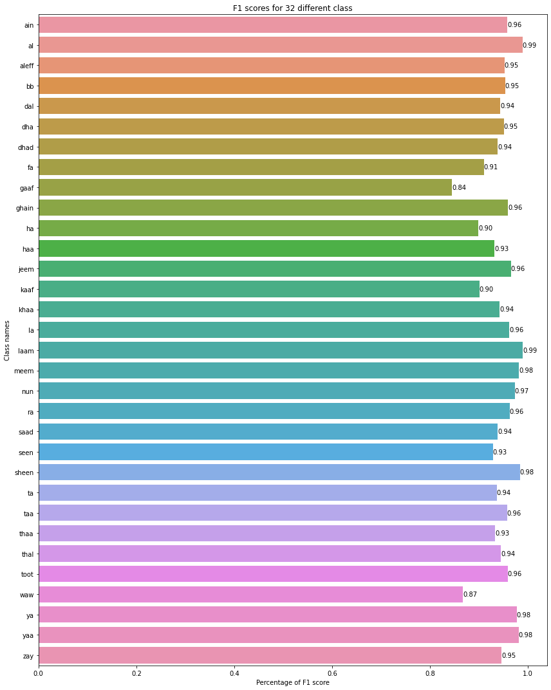


## مقياس إف 1 لمعمارية الشبكات العصبية الترشيحية النسخة 2
لنقوم بفحص المودل و نتائجها بعد تطبيق عملية تقليل العينات

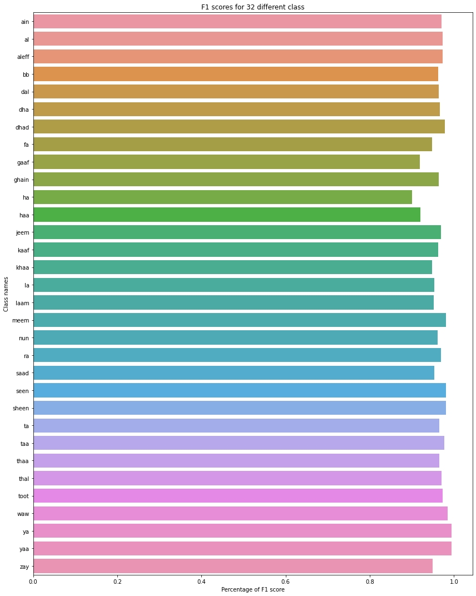

نلاحظ هنا أن الكلاسات تقريباً نفس الشكل في التوزيع ونسبها متقاربة جداً
عكس المودل السابق.

## تصنيف على المجموعة الاختبارية
### النموذج المرجعي
لنرى كيف سيبلي المودل الأول المرجعي الذي قمنا بإنشائها من غير تطبيق تقليل العينات عليه.

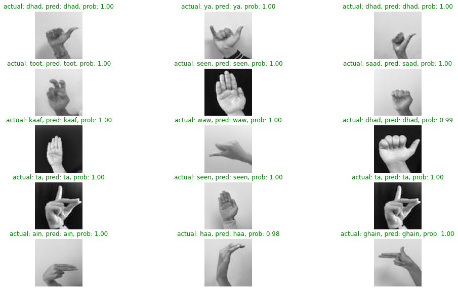

نرى أن التصنيف يكاد أن يكون على جميع الكلاسات بنسبة 100% للجميع وهذا شيء متوقع من مودل حصل على نسبة اعلى من 90% في الدقة.

---
### معمارية الشبكة العصبية الترشيحية النسخة 2
لنقوم الان بإختبار المودل رقم 2 ونرى كيف سيبلي هل سوف يكون مثل النموذج المرجعي أم انه سوف يقوم بتصنيف شيء خاطئ ؟

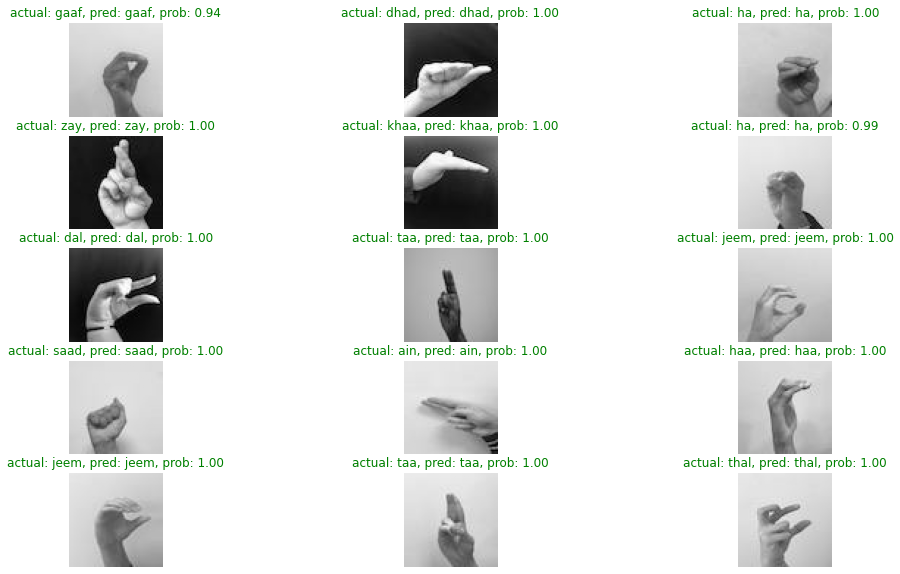

حسناً، كما نرى أن التصنيف لجميع الكلاسات الموجودة بالصورة تكاد تقترب أيضا من 100 % لجميعها لكن تنبيه لا يعني بالضرورة أن العينة التي رأيناها الآن تنطبق على جميع البيانات في العالم لأن بالنهاية هذه بيانات تم تجهيزها من نفس مجموعة البيانات وليست بيانات مختلفة تماماً.


## رفع المشروع على سحابة الكترونية
في جزئية رفع المشروع على موقع هيروكو الشهير صادفت مشكلة ليست بالمشروع ولكن بالسحابة نفسها هنالك سياسات تنص على أن عملية الطلب في HTTP لا تتعدى 30 ثانية وإذا تم اجتياز الوقت سوف يُغلق التطبيق وتتم إعادته للتشغيل مرة أخرى بمعنى أنه فيه عملية التصنيف وقراءة الفيديو هذه العملية لوحدها تستغرق أكثر من 30 ثانية لذلك سوف بالوقت الحالي المشروع سوف يصبح أوف لاين ويمكنكم أن تستعملوه على أجهزتكم الخاصة أو سيرفراتكم. إلى أن أجد طريقة فأنا عائد من جديد لوضعه على الشبكة العنكبوتية مرة أخرى.


### طريقة استعماله وتصنيبه

أول شيء نقوم بنسخ المشروع باستخدام `git`
```sh
git clone Arabic-sign-language-classification

cd Arabic-sign-language-classification
```

نقوم الأن بإنشاء بيئة تطوير افتراضية من أجل تحميل المكتبات اللازمة(هذه الخطوة إختيارية ويمكنكم تخطيها)

هنالك طريقتان من أجل إنشاء البيئة الافتراضية للتطوير:
- باستعمال conda
- باستعمال venv

باستعمال venv:
```sh
# (if there's no virtualenv)
pip install virtualenv 
```
```sh
# Create environment named "venv"
virtualenv venv
```
تفعيل venv:
```sh
source venv/bin/activate
```

نقوم بتحميل المكتبات اللازمة من هذه الملف:
```sh
pip install -r requirements.txt
```

---

تحميل المكتبات وإنشاء البيئة باستعمال conda:
```sh
conda create --name your_environment_name --file requirements.txt
```


## المكتبات المستعملة
- ffmpeg-python==0.2.0
- numpy==1.21.1
- pandas==1.3.5
- opencv-python-headless==4.6.0.66
- ffmpeg==4.2.2
- python-3.7.13
- tensorflow-cpu==2.6.5
- Flask==2.1.3
- protobuf==3.20.1
- gunicorn==20.1.0

## قائمة واحتمالات تطوير المشروع القادمة
قائمة بالسيناريوهات المتوقعة والتقنيات التي سوف تُطبق على المشروع في الاصدارات القادمة

تحسين لمخرجات الفيديو لدينا:
- تجريب مختلف التراميز للفيديوات: VP9, MPEG etc..

دعم اللغة العربية وحروفها في الفيديو:
- باستعمال مكتبة Pillow.

استعمال مختلف المعماريات الأخرى:
- استعمال تقنية التعلم المنقول | Transfer Learning
- تغيير المشكلة من التصنيف إلى Localization or Detection.
- تطوير المشروع إلى دعم تقنية اكتشاف الأشياء والسبب في ذلك راجع كون لغة الإشارة عبارة عن عن الحروف الأبجدية والحركات الوصفية لذلك سوف تقوم باستعمال كلتا يديك من أجل التواصل وهذا يتطلب تصميم معمارية ليست للتصنيف فقط.


## المشاركة بتطوير المشروع
من أراد المشاركة في تحسين أو الإشارة على خطأ رجاء افعلوا ذلك سوف أكون ممتن لكم، لكن أرجوكم قبل رفع Pull request أولاً قُومُوا رجاء بفتح مشكلة Issue لنستطيع المناقشة وبعدها نقوم بحلها.

## التحديثات
سوف أقوم بسرد أهم التحديثات التي تمت بالمشروع هنا..


## المراجع والرخص المستخدمة للحقوق
All rights goes to their respected authors.
```
Latif, Ghazanfar; Alghazo, Jaafar; Mohammad, Nazeeruddin; AlKhalaf, Roaa; AlKhalaf, Rawan (2018), 
“Arabic Alphabets Sign Language Dataset (ArASL)”,
 Mendeley Data, 
 V1, 
 doi: 10.17632/y7pckrw6z2.1
```
الورقة البحثية لأصحاب البيانات: https://www.researchgate.net/publication/331306824_ArASLArabic_Alphabets_Sign_Language_Dataset

