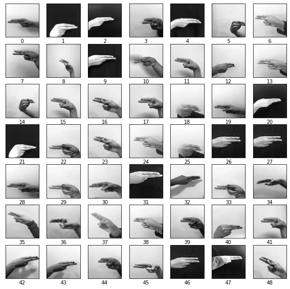
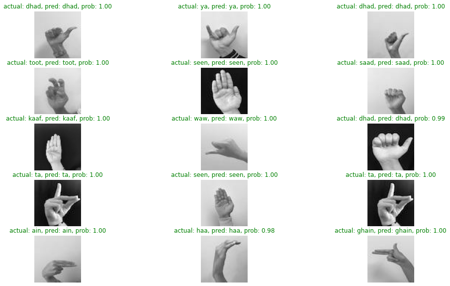
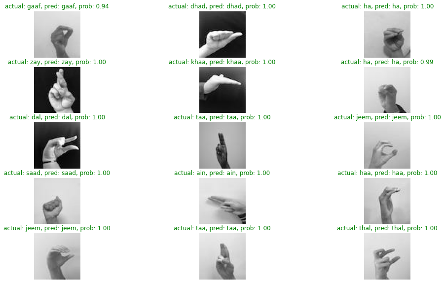

# Arabic sign language classification


Read this in Arabic: [Arabic ver.](README.md)

## Table of Content
- [Arabic sign language classification](#arabic-sign-language-classification)
  - [Table of Content](#table-of-content)
  - [Problem statement](#problem-statement)
  - [Overview of dataset](#overview-of-dataset)
  - [How it works ?](#how-it-works-)
  - [Outputs for classification](#outputs-for-classification)
  - [Data](#data)
  - [Splitting ratios](#splitting-ratios)
  - [EDA](#eda)
    - [Imbalance class](#imbalance-class)
    - [Inspect image dimensions](#inspect-image-dimensions)
      - [Inspect in-depth for dimensions](#inspect-in-depth-for-dimensions)
    - [Visualize one class](#visualize-one-class)
  - [Architectures](#architectures)
    - [Baseline architecture(CNN)](#baseline-architecturecnn)
    - [CNN V2](#cnn-v2)
  - [Loss metrics](#loss-metrics)
    - [Baseline losses metrics](#baseline-losses-metrics)
    - [CNN V2 losses metrics](#cnn-v2-losses-metrics)
  - [Confusion matrix for baseline](#confusion-matrix-for-baseline)
  - [F1 score for baseline(V1)](#f1-score-for-baselinev1)
  - [F1 score for CNN V2](#f1-score-for-cnn-v2)
  - [Predictions on test dataset](#predictions-on-test-dataset)
    - [For Baseline architecture](#for-baseline-architecture)
    - [For CNN V2](#for-cnn-v2)
  - [Deployment](#deployment)
    - [How to use it locally](#how-to-use-it-locally)
  - [Libraries used](#libraries-used)
  - [Things to improve](#things-to-improve)
  - [Contribution](#contribution)
  - [Dev logs](#dev-logs)
  - [Licences and Citations](#licences-and-citations)


## Problem statement
Arabic Sign language classification a problem machine learning trying to solve by classifying which hand gesture belongs to which meaning(class) from a video that passed to the model. And the model try to classify from 32 different meanings(classes). This project used CNN architecture to solve this problem with various layers.


## Overview of dataset
This project based on "Arabic Alphabets Sign Language Dataset (ArASL)" which is a research paper and their respect authors shared that dataset with the community in data mendly [Data Mendely](https://data.mendeley.com/datasets/y7pckrw6z2/1) Big thanks for their awesome work!, I would like you to give it a read. For more information go check [Data section](#Data) for more information about dataset.


## How it works ?
- Prepare a video you want to translate and know which hand gesture used.
- Click browse and navigate to your video.
- Click Submit! Wait for model to classify it.
- Viola! now the translation in green box you can read it.(WIP)


## Outputs for classification
The output from the model will be the same video you sent and at left corner will be the class for each letter from the video according to the model prediction.


## Data
the data where this project takes from: [Dataset page](https://data.mendeley.com/datasets/y7pckrw6z2/1) all rights to their respected authors.
- "A new dataset consists of 54,049 images of ArSL alphabets performed by more than 40 people for 32 standard Arabic signs and alphabets. The number of images per class differs from one class to another. Sample image of all Arabic Language Signs is also attached. The CSV file contains the Label of each corresponding Arabic Sign Language Image based on the image file name."

## Splitting ratios
With splitting I used an awesome library called [Split folders](https://pypi.org/project/split-folders/). The splits go with 60% for training, 20% for validation and 20% for test sets. Later on for data loading we're gonna use `ImageDataGenrator` so we could use data augmentation on the fly.


## EDA
### Imbalance class
Let's check for each subdirectory which holds images for each class and get some insights on the class distribution and check whether it's balanced or not


We can see that it's not class balanced because there's different peaks and it's way above the others and there's classes lower than the other in a way that hard to not see it such as: "AL", "WAW", "YAA". So the process will be to undersampling the rest to the minimum value for each split in subdirectories[train, validation, test].


### Inspect image dimensions
Check the images if there's any random dimension (width + height) so that in the preprocessing step of the images and before batching the dataset we need to see which numbers of width & height of majority of images:


After inspecting the images it's crystall clear that majority of numbers are standardized to certain dimensions.


#### Inspect in-depth for dimensions
Let's see which dimensions are those for heights & widths that we got from the plot above. So that for preprocessing we can reshape to the minimum dimension because reshaping images with lower better for machine learning to get patterns from image rather than stretching pixels to higher dimension and lose it's information.

**For Height dimension**:
```python
values, counts = np.unique(dim1, return_counts=True)
values, counts

# Outputs: (array([  64,  256, 1024]), array([53401,   638,    10]))
```

**For Width dimension**:
```python
values_2, counts_2 = np.unique(dim2, return_counts=True)
values_2, counts_2

# Outputs: (array([ 64, 256, 768]), array([53401,   638,    10]))
```

We can see that the counts for each samples: [53401,   638,    10] it's clearly showing that images with 64 * 64 shape have the highest samples with "53401" in total.


### Visualize one class
Let's visualize one class from the dataset and see which angles token from, placement of hands, color map, brigtness, corrputed images?, background of images, image noises such as people behind.

This is from class(letter) "Ain"


Good! now we got to know that those images decoded as grayscale so that before training the model we need to preprocess it as 3 channels to make our model accept and train on dataset.

## Architectures
### Baseline architecture(CNN)
the architecture of the baseline network used in this project are:
| Layer Name | Value |
| ---- | ---- | 
| Conv2D | Filters=64, Kernels=3 |
| MaxPool2D | Default=2 |
| Conv2D | Filters=64, Kernels=3  |
| MaxPool2D | Default=2 |
| Conv2D | Filters=128, Kernels=3 |
| Conv2D | Filters=128, Kernels=3 |
| MaxPool2D | Default=2 |
| GlobalAveragePooling2D | Without passing anything keep defaults |
| Dense | units=32 with softmax |

Evaluation Score on test dataset:
```sh
loss = 25%, accuracy= 94%.
```

----
### CNN V2
CNN architecture V2 that beat the baseline architecture score and it did with 96% accuracy and 22% loss.
| Layer Name | Value |
| ---- | ---- | 
| Conv2D | Filters=64, Kernels=3 |
| MaxPool2D | Default=2 |
| Conv2D | Filters=64, Kernels=3  |
| MaxPool2D | Default=2 |
| Conv2D | Filters=128, Kernels=3 |
| Conv2D | Filters=128, Kernels=3 |
| MaxPool2D | Default=2 |
| GlobalAveragePooling2D | Without passing anything keep defaults |
| Dense | units=32 with softmax |

The difference between the two experiments the 1st trained **without** undersampling, the 2nd trained **with** undersampling


## Loss metrics
### Baseline losses metrics
Check and see how the model performed during the training process for the baseline model.


We can see that `val_loss` it's overfitting and NOT converging to good number but for future development we need to generalize the data more for high accuracy prediction to wild images by using undersampling & augmentation, Lets test it out with 2nd experiment.


---
### CNN V2 losses metrics
For `CNN V2` it's a little bit optimized for validation loss.


This time with CNN improved the line more smooth but still there's overfitting, The two lines they're near each other both the orange & blue line but crossing each other in wide length which an indicators that's it's overfitting and it has been learning the samples too well which gives bad results with wild images.


## Confusion matrix for baseline
A good and visual way to compare the predicted labels with true labels (ground truth) in tabular way and it's flexible. The good predictions will form a line from top left to bottom right (diagonal line). The other boxes other than `diagonal line` will be FP (False positives), FN (False negative).


From this evaluation method we can interpret something which as we can see we have a confusion between "gaaf" & "fa" letters because to be honest even for us humans it's confusing to differentiate between the two for beginners.

Also, it happens again with "Kaaf" & "seen" they're highly similar to each other, So our model poorly predicting it. And there's slight confusion with 
"Kaaf" & "Thaa" since it's also look similar.

**Key point here: The arabic sign language letter gestures there's some gestures which are similars to each other and need more processing and maybe try different way to compare the labels instead of numbers of classes replace it with mask or leverage the problem with localization & detection.**


## F1 score for baseline(V1)
Lets check the F1 score, which is a metric that combines Recall + Precision together. And for short: 
- Recall: Model predicts 0's when it's 1
- Precision: Model predicts 1's when it's 0

That's for binary classification problems, but it's a little bit different for multi-class classification for more information on this: https://parasite.id/blog/2018-12-13-model-evaluation/


## F1 score for CNN V2
Let's check the F1 scores for the model 2 with undersampling.


It's clear that with CNN V2 the classes got that balance feeling to it, Well it's obvious since we undersample it in preprocessing step.

## Predictions on test dataset
### For Baseline architecture
Lets see how our model V1 performs on the artificial test data



We can see that model predicts the test sets with good accuracy nearly to a great 100%.

---
### For CNN V2
Lets visualize the Baseline killer(CNN model V2) and see if it gets more correct predictions or gets wrong classes.



Well, That's what to expect from a model that gets accuracy of more than 90%. Disclimar: if it gets all the label here doesn't mean it'll be good with wild images because the test set is artificial. 


## Deployment
For deployment we got a problem with heroku dyno which allows only 30s request after that the application will timeout for now due to `model.predict()` I will search for a workaround this request timeout. the application built on flask framework so for now it'll be only offline verison you can download it and lunch from flask development phase.

### How to use it locally

Firstly clone the repo using `git`
```sh
git clone Arabic-sign-language-classification

cd Arabic-sign-language-classification
```

Now we need virtual environment to install all dependecy needed inside
the environment(optional if you don't want to create env)

there's two ways:
- Using conda
- Using venv

Using venv:
```sh
# (if there's no virtualenv)
pip install virtualenv 
```
```sh
# Create environment named "venv"
virtualenv venv
```
Activate venv:
```sh
source venv/bin/activate
```

install requirements packages:
```sh
pip install -r requirements.txt
```

---

Creating environment using conda:
```sh
conda create --name your_environment_name --file requirements.txt
```


## Libraries used
- ffmpeg-python==0.2.0
- numpy==1.21.1
- pandas==1.3.5
- opencv-python-headless==4.6.0.66
- ffmpeg==4.2.2
- python-3.7.13
- tensorflow-cpu==2.6.5
- Flask==2.1.3
- protobuf==3.20.1
- gunicorn==20.1.0

## Things to improve
A list of possible scenarios and techniques to improve this project.

Optimization for video output:
- experiment with codecs: VP9, MPEG etc..

Support Arabic letters encoding in videos:
- By using libaries like Pillow.

Using different architectures:
- Leveraging the power of transfer learning.
- Changing the problem type from classification instead of localization.
- Leveling up the game to detection domain so that it can predict not only as alphabet sign language but as descriptive sign language. Which involves fast hand signs & two hands gestures at the same time.


## Contribution
For contribution part feel free to do so, But could you please firstly open an issue first to discuss what to change or contribute then open a pull request.

## Dev logs
There will be continous updates to this project...


## Licences and Citations
All rights goes to their respected authors.
```
Latif, Ghazanfar; Alghazo, Jaafar; Mohammad, Nazeeruddin; AlKhalaf, Roaa; AlKhalaf, Rawan (2018), 
“Arabic Alphabets Sign Language Dataset (ArASL)”,
 Mendeley Data, 
 V1, 
 doi: 10.17632/y7pckrw6z2.1
```
Check their paper at: https://www.researchgate.net/publication/331306824_ArASLArabic_Alphabets_Sign_Language_Dataset

